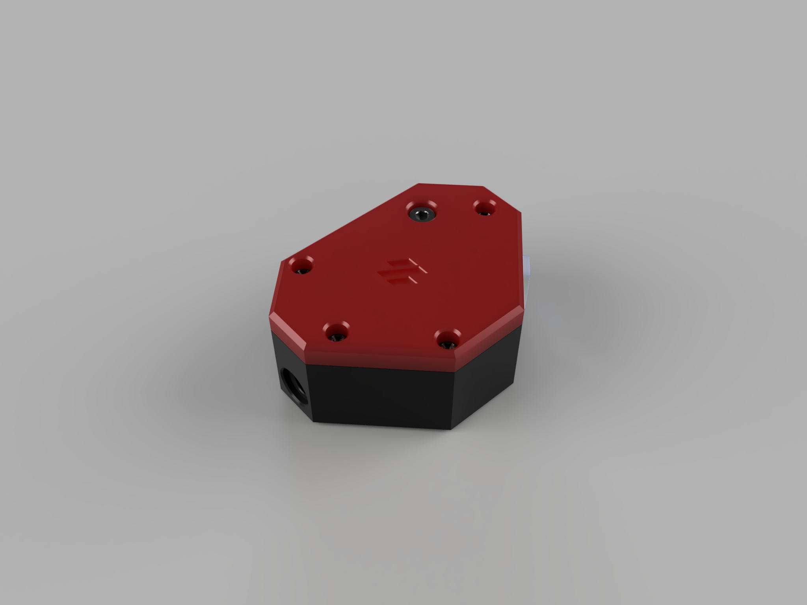
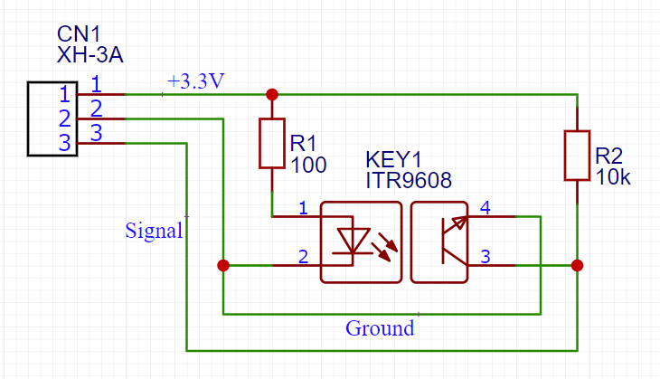
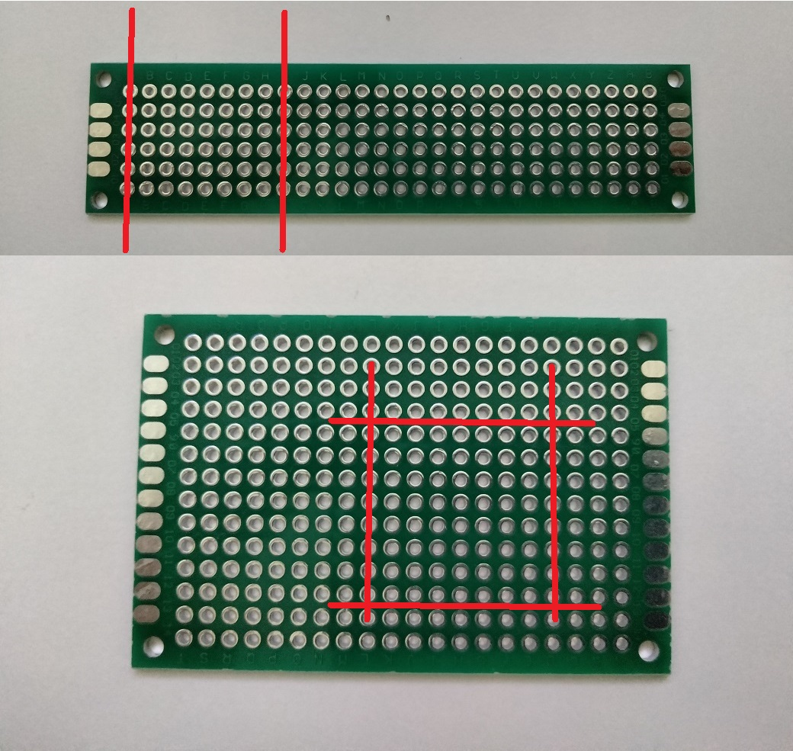
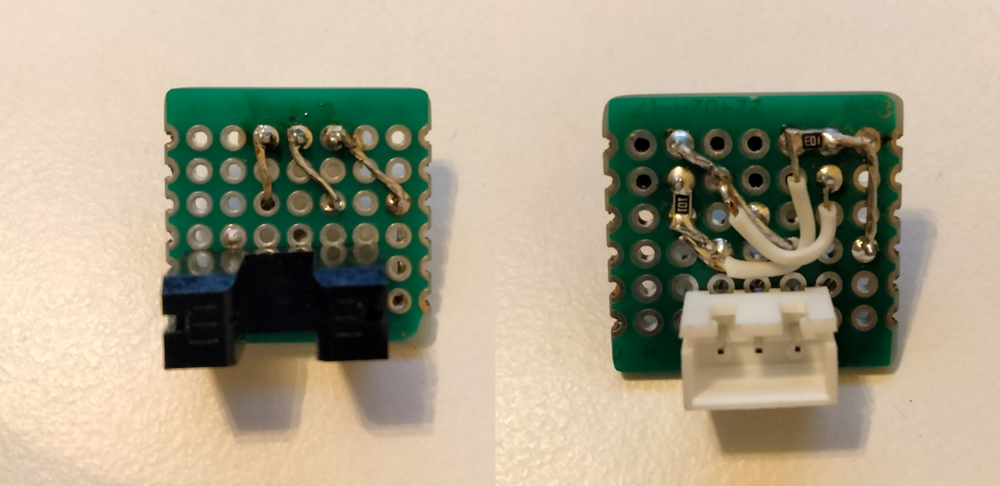
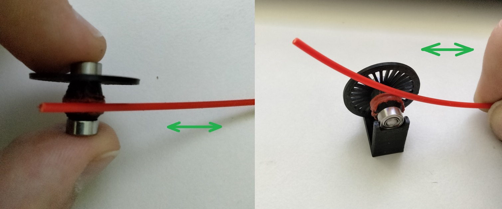
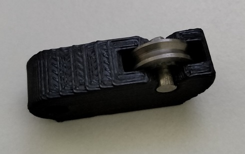
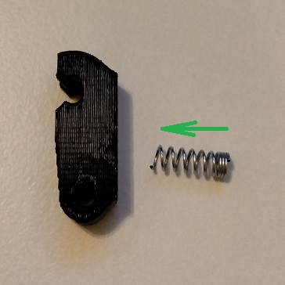
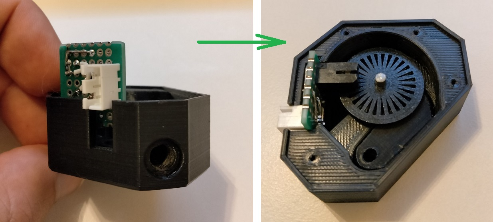
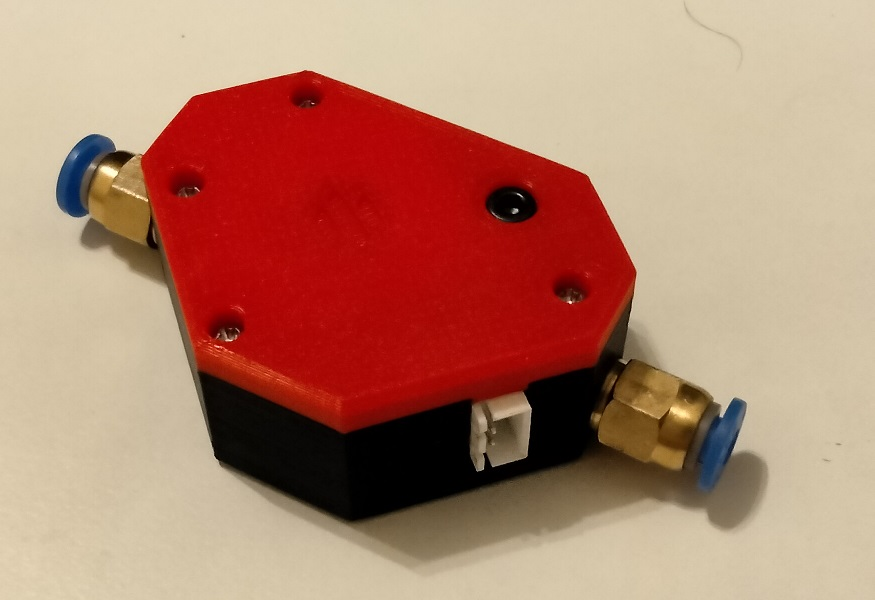

# Smart Filament Sensor

Just like a BigTreeTech's Smart Filament Sensor, only better.

I wanted to add a filament sensor to my printer, but not the common yes/no one. So I was contemplating buying a BTT's sensor, therefore watched a couple of reviews. Fortunately I found one that exposed how garbage it is. On top of that I don't like that 75% of the sensor body hangs from the side. What really got me is the fact it requires 7 mm of filament to notice that's something is wrong. That's 9.4 cubic mm of filament. Just to put it into perspective - it is 74.8 mm of head movement with 0.4 nozzle! Good luck resuming your print.
This is how this little project was born - my humble attempt to create a smaller, lighter and faster version of BTT's Smart Filament Sensor.

Highlights:
* More compact design overall
* Longest case dimension is in-line with filament path, so nothing hangs to the side
* Just about 0.7 mm filament sense distance

## Parts Required

### Mechanics

* (1) M3x20 SHCS screw
* (1) Spring (from a click pen)
* (4) M2x10 self-tapping screws OR (4) #2x1/4" self-tapping screws
* (2) 3x7x3 ball bearings
* (1) 3x10x3 guide ball bearing
* (1) 3mm steel shaft - 8mm long
* (1) 3mm steel shaft - 16mm long (15 to 20 mm will work nicely)
* (2) PC4-M6 Pneumatic fitting (optional)
* Red RTV Silicone, or any other 100% silicone (silicone sealants might work too)

### Electronics

* (1) Optical sensor - photo interrupter. Really anything with the same dimensions works. If you have optical endstops from old printers/scanners (even old 3d printers), you are all set.
* (1) XH-3A connector
* (1) piece of prototype board
* (1) 10K ohms SMD resistor
* (1) 100 ohms SMD resistor (assuming your board supplies 3.3 volts for sensors)
* Some wires

## Printing

Printing parts with standard Voron spec is recommended. However, I printed mine in PLA with 0.4mm nozzle, 0.2mm layers, 2 walls + alternating extra wall, 4 tops, 4 bottoms, 10% infill while prototyping and parts came plenty strong for their purpose.

If you are using M2x10 screws print:
* [a]_lid_m2.stl
If you are using #2x1/4 screws print:
* [a]_lid_sae.stl
If you want to use pneumatic fittings print:
* case_fit.stl
If you want just a regular 4.2mm holes to plug bowden tubes print:
* case_plug.stl

In either case print 1 each:
* wheel.stl - you actually might want to print a few just in case, it's a fragile part and can be easily damaged
* idler.stl
* rtv_jig.stl - optional, helps greatly to apply RTV/silicone to the wheel

## Assembly

### Electronics

It's good to do some math prior to all the soldering. Let's make sure the resistor values are right. Photointerrupter has 2 sides: emitter and receiver.
Current-limiting resistor for the emitter is the most important. It is pretty easy to calculate though: R = (V~brd~ - V~fwd~) / I~fwd~
V~brd~ is the voltage your board supplies to the sensor. Usually it's 3.3 V.
V~fwd~ is the forward voltage drop of the emitting diode. For ITR9608 it is 1.2 V.
I~fwd~ is the forward current of the emitting diode. For ITR9608 it is 20 mA.
So (3.3 - 1.2) / 0.02 = 105. There is no such thing as 105-ohm resistor, 2 closest available values are 100 and 110.
If your board uses different voltage or you are using a different photointerrupter - check the datasheet.

Schematic is super easy! Just 4 components:

1. Cut a 20x20 mm piece of prototype board. If you happen to have 20x80 (2x8 cm) boards - it's easy, just score along a row of vias, skip 8 rows and score another one. Break the board, along your score marks, smoothen it with a file. It is a little bit trickier on a larger boards - you'll need to bust out your dremel. Draw the lines as below and cut. File it smooth. It is critical that both board dimensions are 20mm and the connector is about 0.5 mm from the edge. Everything else is somewhat lenient.

2. Solder in a photo sensor.
3. Solder both resistors and all the connecting wires. Leave the wires that are going to be connected to a connector loose.
4. Solder in a connector.
5. Solder wires to the connector.

Here's what my board looks like (just for reference):

### The sensor

1. Push a 16 mm shaft into the wheel. It is supposed to be a very snug fit, so wheel wouldn't slide along the shaft. Here's a neat little trick: if the fit is too tight chuck the shaft into a drill, spin it and push into the wheel. Use light hammer taps to sit it right in the middle.
2. Apply RTV to a groove on a wheel part. You can use an unbent paperclip to scoop some RTV from the tube and spread it along the groove. Use a piece of filament to make an even coating. Put the bearings on temporarily, put the assembly into a jig (or just hold by the bearings with your fingers) and rub the filament back and forth as the wheel spins. Let it dry for ~10 minutes. Repeat. Apply a total of at least 4 coats of RTV this way. For the last coat wet your filament with water - rubbing silicone with a wet filament will push it really good and smoothen the surface.

3. Put a smaller shaft through the guide bearing and push it into the idler arm.

5. Push both 3x7x3 bearings into their corresponding positions.
4. Cut a 12 mm piece of the click pen spring. Put it into a recess inside the idler arm, cut side in. Push the idler against the wall, compressing the spring, and slide it into position.

6. Start the board into its slot. While the board it half-way in, line up the wheel with the bearing and push both board and the wheel all the way in.

7. Put both parts of the case together, making sure the shaft goes inside the bearing. Fix it with 4 self-tapping screws.
8. Thread the M3 screw into the remaining hole so it becomes a shaft for the idler assembly.
9. Thread in both pneumatic fittings. The sensor is ready.

## Video stuff

Assembly and testing: 

## Sourcing

Photo interrupters: https://www.amazon.com/HiLetgo-ITR9608-F-Photoelectric-Optical-Interrupter/dp/B00M1PMFGE/
\#2 screws: https://www.amazon.com/Qjaiune-Stainless-Phillips-Self-Tapping-Drywall/dp/B098QL1MCM/
Prototype boards: https://www.amazon.com/ELEGOO-Prototype-Soldering-Compatible-Arduino/dp/B072Z7Y19F/
Connector: from this kit https://www.amazon.com/gp/product/B082234HSS/
3x7x3 bearings: https://www.amazon.com/dp/B07FW18RQY/
3x10x3 guide bearings: https://www.amazon.com/dp/B08H2B8TT1/
3mm rod: https://www.amazon.com/dp/B082ZNW9RW/
Pneumatic fittings: https://www.amazon.com/dp/B07ZCN35GY/

